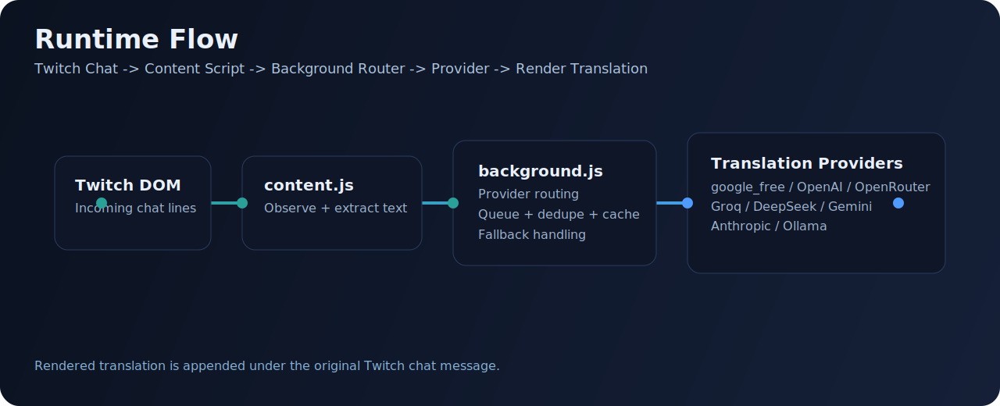

# Twitch Chat AI Translator (繁中)

  

  
  
  
  
  

  把 Twitch 聊天室中的非中文訊息，即時翻成自然繁體中文。 
  針對高速聊天室設計：並行翻譯、去重、快取、爆量保護。

  <a href="#quick-start-1-minute">Quick Start</a> ·
  <a href="#provider-support">Provider Support</a> ·
  <a href="#preview">Preview</a> ·
  <a href="#architecture">Architecture</a>

---

## Why This Project

| Value | What You Get |
| --- | --- |
| 即時體驗 | 直播聊天室可用，訊息不是晚一大段才翻譯 |
| 可切換供應商 | 免 API / OpenAI / OpenRouter / Groq / DeepSeek / Gemini / Claude / Ollama |
| 設定集中 | 進階設定已整合在 popup，不需要跳轉額外設定頁 |
| 易讀輸出 | 以繁體中文聊天室語感為目標，避免生硬字面翻譯 |

---

## Preview

### Popup Advanced Settings

  

### Runtime Architecture

  

---

## Quick Start (1 Minute)

1. 打開 Chrome：`chrome://extensions`
2. 開啟 **Developer mode**
3. 點 **Load unpacked**
4. 選擇專案資料夾：`/home/zxc30302207/code/codex-workspace/TWITCH`
5. 釘選插件後點開 popup
6. 保持預設 `免 API` 直接使用，或改成你要的 provider 後儲存

---

## Provider Support

| Provider | API Key | Default Endpoint | Default Model |
| --- | --- | --- | --- |
| `google_free` | No | Public translate endpoint | - |
| `openai` | Yes | `https://api.openai.com/v1/chat/completions` | `gpt-4.1-mini` |
| `openrouter` | Yes | `https://openrouter.ai/api/v1/chat/completions` | `openai/gpt-4o-mini` |
| `groq` | Yes | `https://api.groq.com/openai/v1/chat/completions` | `llama-3.1-8b-instant` |
| `deepseek` | Yes | `https://api.deepseek.com/chat/completions` | `deepseek-chat` |
| `gemini` | Yes | `https://generativelanguage.googleapis.com/v1beta` | `gemini-2.0-flash` |
| `anthropic` | Yes | `https://api.anthropic.com/v1/messages` | `claude-3-5-haiku-latest` |
| `ollama` | Usually No | `http://127.0.0.1:11434/v1/chat/completions` | `qwen2.5:7b` |

---

## Runtime Behavior

- 支援網域：`twitch.tv`、`www.twitch.tv`、`m.twitch.tv`
- 每則可翻譯訊息會在原文下方插入翻譯
- 指令型訊息、過短訊息、雜訊會自動略過
- 需要金鑰的 provider 未填 key 時，會回退到 `google_free`

---

## Architecture

| File | Responsibility |
| --- | --- |
| `manifest.json` | Manifest、權限、content script、background worker |
| `content.js` | 監看 Twitch 聊天 DOM，抽取訊息並插入翻譯 |
| `background.js` | Provider 路由、API 呼叫、排程、快取、錯誤回退 |
| `popup.html` / `popup.css` / `popup.js` | 插件 UI、即時開關、進階設定與儲存 |
| `options.*` | Legacy 設定頁（目前仍保留） |

---

## Performance Design

- Concurrent workers（`MAX_CONCURRENT_REQUESTS`）
- In-flight dedupe（相同訊息/供應商鍵值只送一次）
- Queue trimming（爆量時優先新訊息）
- Translation cache（重複訊息直接命中）

---

## Security Notes

- API keys 儲存在 `chrome.storage.sync`
- 只對已授權 provider domain 發送請求
- 若要正式商用，建議改為後端簽發短時 token，避免長期密鑰直接留在客戶端

---

## Roadmap

- 頻道級翻譯規則（白名單/黑名單）
- 語言偵測後路由（不同語種走不同 provider）
- 更完整的梗圖/俚語/表情語境處理
- 本地模型優先策略（offline-first）
