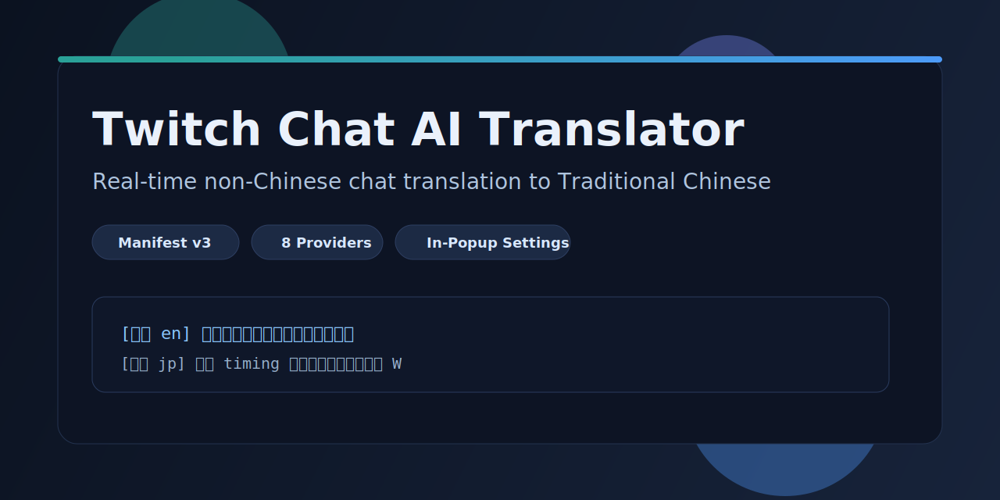
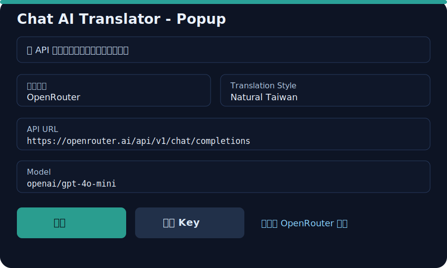

# Twitch Chat AI Translator (繁中)

  

  
  
  
  
  

A high-performance Chrome extension for **real-time Twitch chat translation** into **Traditional Chinese (繁體中文)**.

> Built for live chat speed, flexible provider routing, and readable Taiwan-style output.

---

## Highlights

- Real-time translation for non-Chinese Twitch chat messages
- Taiwan-style Traditional Chinese output with natural tone options
- Built-in multi-provider routing
- No-key mode available out of the box (`google_free`)
- In-popup advanced settings (no separate settings page required)
- Queue concurrency, in-flight deduplication, and LRU-style cache for live stream traffic

---

## Screenshots

### Popup Advanced Settings

  

---

## Provider Support

| Provider | API Key | Default Endpoint | Default Model |
| --- | --- | --- | --- |
| `google_free` | No | Public translate endpoint | - |
| `openai` | Yes | `https://api.openai.com/v1/chat/completions` | `gpt-4.1-mini` |
| `openrouter` | Yes | `https://openrouter.ai/api/v1/chat/completions` | `openai/gpt-4o-mini` |
| `groq` | Yes | `https://api.groq.com/openai/v1/chat/completions` | `llama-3.1-8b-instant` |
| `deepseek` | Yes | `https://api.deepseek.com/chat/completions` | `deepseek-chat` |
| `gemini` | Yes | `https://generativelanguage.googleapis.com/v1beta` | `gemini-2.0-flash` |
| `anthropic` | Yes | `https://api.anthropic.com/v1/messages` | `claude-3-5-haiku-latest` |
| `ollama` | Usually No | `http://127.0.0.1:11434/v1/chat/completions` | `qwen2.5:7b` |

---

## Quick Start

1. Open Chrome: `chrome://extensions`
2. Enable **Developer mode**
3. Click **Load unpacked**
4. Select this folder:
   `/home/zxc30302207/code/codex-workspace/TWITCH`
5. Pin extension and open popup
6. Keep default `免 API` mode, or switch provider and save credentials

---

## Usage

- Supported domains:
  - `twitch.tv`
  - `www.twitch.tv`
  - `m.twitch.tv`
- Translations are appended under each chat line in real time
- Messages are skipped if they are command-like, too short, or non-translatable noise

---

## In-Popup Advanced Settings

All advanced settings are available directly in the extension popup:

- Provider
- API Key
- API URL
- Model
- Temperature
- Translation style
- Minimum message length

No external settings page is required during normal use.

---

## Architecture

- `manifest.json`
  - Extension manifest, permissions, content-script injection, background worker
- `background.js`
  - Provider routing, API requests, queue processing, cache, fallback behavior
- `content.js`
  - Twitch DOM observation and translated text injection into chat lines
- `popup.html` / `popup.css` / `popup.js`
  - Runtime controls and full advanced configuration UI
- `options.*`
  - Legacy/extended settings entry (still retained in project)

---

## Performance Design

To stay responsive in high-volume chats:

- Concurrent request workers (`MAX_CONCURRENT_REQUESTS`)
- In-flight dedupe for same message/provider key
- Queue trimming when incoming rate exceeds backlog threshold
- Cache reuse for repeated text

These controls are implemented in `background.js`.

---

## Privacy & Security Notes

- API keys are stored in extension storage (`chrome.storage.sync`)
- Requests are sent only to configured/allowed provider domains
- If a key-required provider has no key, translator falls back to `google_free`

For production publishing, consider migrating secrets to a safer token flow (server-issued short-lived tokens).

---

## Development Notes

- Manifest version: `v3`
- Tested workflow: unpacked extension in Chrome
- Main runtime paths:
  - Content script on Twitch pages
  - Background service worker for translation orchestration

---

## Roadmap Ideas

- Channel-level translation rules (whitelist/blacklist)
- Per-language routing strategy
- Better emote/context-aware slang adaptation
- Optional local-only translation pipeline
